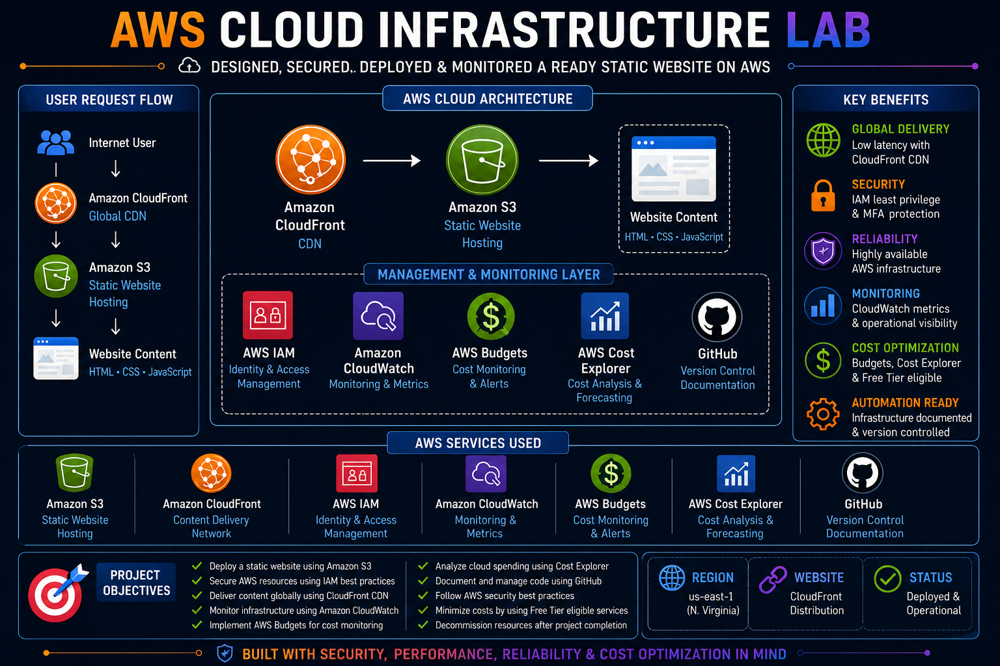
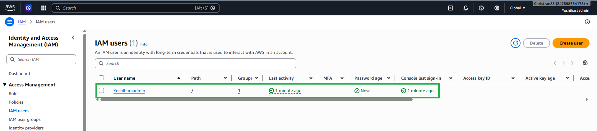
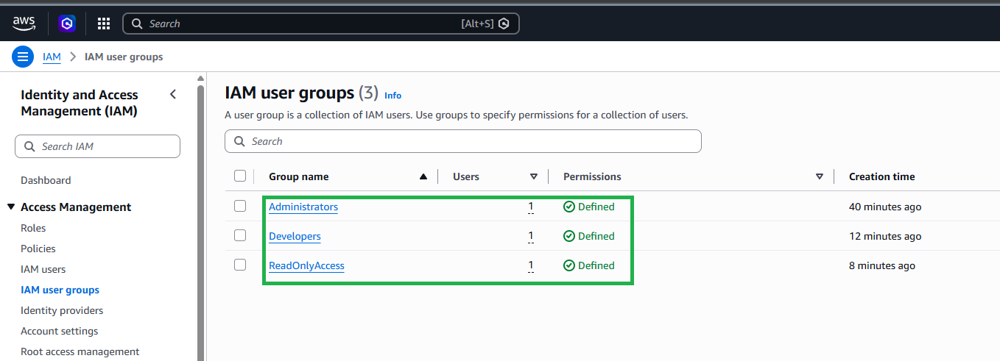
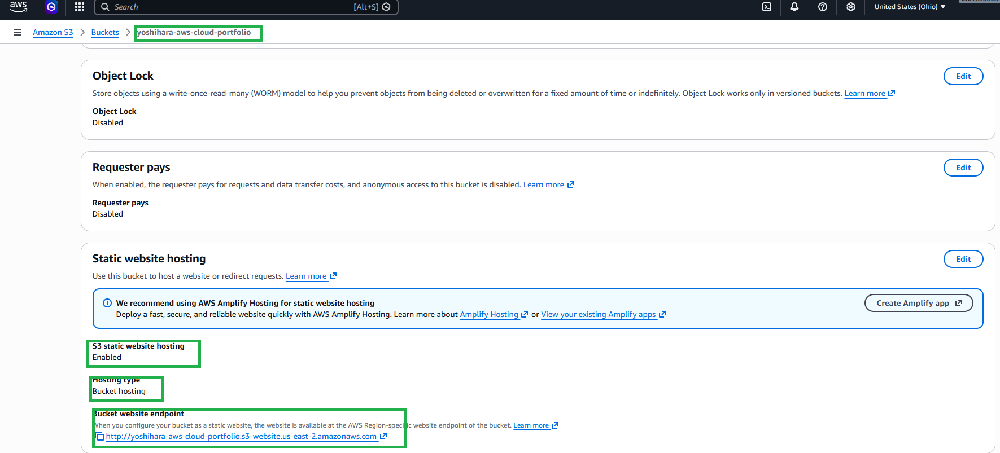

<div align="center">

# ☁️ AWS Enterprise Cloud Infrastructure Lab

### Designing, Securing, Deploying, and Monitoring a Secure Static Website on Amazon Web Services


</div>

---



# Overview

This project demonstrates the deployment of a secure, scalable cloud infrastructure using core Amazon Web Services (AWS).

The environment was built to simulate a production-ready static website while implementing AWS security best practices, content delivery, monitoring, and cloud cost management.

The project aligns with AWS Cloud Practitioner (CLF-C02) objectives and provides practical experience with identity management, static website hosting, content delivery networks (CDN), monitoring, and operational cost optimization.

---

# AWS Services Used

- Amazon S3
- Amazon CloudFront
- AWS Identity and Access Management (IAM)
- Amazon CloudWatch
- AWS Budgets
- AWS Cost Explorer
- GitHub
- AWS Well-Architected Framework

---

# Environment

| Component | Purpose |
|------------|------------|
| AWS Management Console | Cloud Administration |
| Amazon S3 | Static Website Hosting |
| Amazon CloudFront | Global Content Delivery |
| AWS IAM | Identity & Access Management |
| Amazon CloudWatch | Infrastructure Monitoring |
| AWS Budgets | Cost Monitoring |
| AWS Cost Explorer | Billing Analysis |
| GitHub | Source Code Management |

---

# Cloud Architecture

## User Request Flow

```text
Internet User
      │
      ▼
Amazon CloudFront
      │
      ▼
Amazon S3 Static Website
      │
      ▼
HTML • CSS • JavaScript
```

---

## Management Services

The infrastructure uses several AWS services to improve security, monitoring, and operational visibility.

- IAM manages authentication and authorization.
- CloudWatch provides centralized monitoring.
- AWS Budgets monitors monthly cloud spending.
- AWS Cost Explorer analyzes resource usage.
- GitHub provides version control.

---

# Project Objectives

- Deploy a production-ready static website using Amazon S3
- Secure AWS resources using IAM
- Deliver content globally with Amazon CloudFront
- Monitor infrastructure using CloudWatch
- Implement AWS Budgets
- Analyze cloud spending using Cost Explorer
- Follow AWS Well-Architected best practices

---

# Phase 1: AWS Account Security

## Configure AWS Account

Security best practices were implemented before deploying cloud resources.

### Tasks Completed

- Enabled Multi-Factor Authentication (MFA)
- Created IAM Administrator
- Restricted Root Account Usage
- Configured Password Policy
- Verified Contact Information

### IAM Administrator

| Setting | Value |
|----------|----------|
| Username | Yoshiharaadmin |
| Access | Console |
| MFA | Enabled |
| Permissions | AdministratorAccess |

### Outcome

Administrative tasks are performed using IAM instead of the AWS Root account.

### Screenshot



---


# Phase 2: Identity and Access Management

## Configure IAM

AWS Identity and Access Management (IAM) was configured following least privilege principles.

### Tasks Completed

- Created IAM Users
- Created IAM Groups
- Assigned IAM Policies
- Enabled MFA
- Applied Least Privilege

### IAM Groups

| Group | Permissions |
|----------|----------|
| Administrators | AdministratorAccess |
| Developers | PowerUserAccess |
| ReadOnlyAccess | ReadOnlyAccess |

### Security Features

- MFA
- Password Policies
- RBAC
- Least Privilege

### Outcome

AWS resources are managed through IAM instead of the Root account.

## Screenshot




---

# Phase 3: Amazon S3 Static Website Hosting

## Deploy Static Website

Amazon S3 was configured to host a static website.

### Bucket Configuration

| Setting | Value |
|----------|----------|
| Region | us-east-1 |
| Versioning | Enabled |
| Encryption | AES-256 |
| Static Website Hosting | Enabled |

### Website Files

- index.html
- style.css
- script.js

### Tasks Completed

- Created S3 Bucket
- Enabled Versioning
- Enabled Encryption
- Enabled Static Website Hosting
- Uploaded Website Files

### Outcome

The website was successfully deployed using Amazon S3 Static Website Hosting.

**Screenshot**

...



```

---

# Phase 4: Amazon CloudFront

## Configure Content Delivery Network

Amazon CloudFront was deployed in front of the Amazon S3 static website to improve website performance, reduce latency, and provide secure HTTPS access.

### Distribution Configuration

| Setting | Value |
|----------|----------|
| Origin | Amazon S3 Static Website |
| Distribution Type | Single Website |
| HTTPS | Enabled |
| Compression | Enabled |
| Caching | AWS Recommended |
| Price Class | Use All Edge Locations |

### Tasks Completed

- Created CloudFront Distribution
- Connected Distribution to Amazon S3
- Enabled HTTPS Delivery
- Configured Default Root Object
- Enabled Compression
- Tested Website Accessibility

### Benefits

- Global Content Delivery
- Lower Latency
- HTTPS Encryption
- Edge Caching
- Improved Availability
- DDoS Resilience through AWS Edge Network

### Outcome

Website traffic is securely delivered through Amazon CloudFront using HTTPS while improving performance through AWS Global Edge Locations.

**Screenshot**

```
screenshots/04-cloudfront.png
```

---

# Phase 5: Amazon CloudWatch

## Monitor Cloud Infrastructure

Amazon CloudWatch was used to explore AWS monitoring services and review infrastructure monitoring capabilities.

### Monitoring Tasks

- Opened Amazon CloudWatch
- Explored CloudWatch Metrics
- Reviewed AWS Monitoring Services
- Examined CloudWatch Dashboards
- Learned CloudWatch Monitoring Workflow

### Services Reviewed

| Service | Purpose |
|----------|----------|
| Amazon CloudWatch | Infrastructure Monitoring |
| Amazon S3 | Storage Metrics |
| Amazon CloudFront | Performance Monitoring |

### Monitoring Features

- Metrics
- Dashboards
- Alarms
- Logs
- Application Monitoring
- Infrastructure Monitoring

### Outcome

Amazon CloudWatch provides centralized monitoring, operational visibility, and infrastructure health monitoring for AWS cloud resources.

**Screenshot**

```
screenshots/05-cloudwatch.png
```

---

# Phase 6: AWS Cost Management

## Configure Cost Monitoring

AWS Cost Management services were configured to monitor cloud spending and prevent unexpected charges.

### Tasks Completed

- Created Monthly AWS Budget
- Configured Budget Notifications
- Enabled AWS Cost Explorer
- Reviewed Billing Dashboard
- Monitored AWS Free Tier Usage

### Services Used

| Service | Purpose |
|----------|----------|
| AWS Budgets | Spending Alerts |
| AWS Cost Explorer | Cost Analysis |
| Billing Dashboard | Cost Monitoring |
| AWS Free Tier | Usage Tracking |

### Cost Optimization

The infrastructure was designed to minimize operational costs by utilizing Free Tier eligible AWS services whenever possible.

### Outcome

AWS Cost Management provides visibility into cloud spending while helping maintain cost-efficient cloud operations.

**Screenshot**

```
screenshots/06-budget.png
```

```
screenshots/06-cost-explorer.png
```

---

# Phase 7: Resource Cleanup

## Decommission AWS Infrastructure

After validating the environment and documenting the project, AWS resources were removed to prevent unnecessary cloud charges.

### Resources Removed

- Amazon CloudFront Distribution
- Amazon S3 Static Website
- Website Objects

### Cleanup Tasks

- Verified screenshots were captured
- Confirmed GitHub documentation was completed
- Disabled CloudFront Distribution
- Deleted CloudFront Distribution
- Deleted Amazon S3 Bucket
- Verified no unnecessary billable resources remained

### Outcome

The AWS environment was successfully decommissioned while preserving all project documentation, screenshots, GitHub source code, and deployment artifacts.

---
# Results

The environment successfully demonstrated:

✅ AWS Account Security

✅ Identity and Access Management (IAM)

✅ Amazon S3 Static Website Hosting

✅ Amazon CloudFront Content Delivery

✅ HTTPS Website Delivery

✅ Amazon CloudWatch Monitoring

✅ AWS Cost Management

✅ GitHub Version Control

✅ Cloud Infrastructure Deployment

✅ AWS Well-Architected Best Practices

---

# Skills Demonstrated

## Cloud Infrastructure

- Amazon S3
- Amazon CloudFront
- AWS Identity and Access Management (IAM)
- Amazon CloudWatch
- AWS Budgets
- AWS Cost Explorer

---

## Identity & Security

- IAM Users
- IAM Groups
- IAM Policies
- Least Privilege
- Multi-Factor Authentication (MFA)
- HTTPS Website Delivery
- AWS Account Security

---

## Website Hosting

- Static Website Hosting
- Content Delivery Networks (CDN)
- Global Edge Locations
- Edge Caching
- Cloud Storage
- Website Deployment

---

## Monitoring

- Amazon CloudWatch
- Cloud Metrics
- Infrastructure Monitoring
- Operational Visibility

---

## Cost Management

- AWS Budgets
- AWS Cost Explorer
- AWS Billing Dashboard
- AWS Free Tier Optimization
- Cloud Cost Monitoring

---

## Version Control

- Git
- GitHub
- Repository Documentation
- Markdown
- Project Documentation

---

# Lessons Learned

Throughout this project, several AWS concepts were reinforced through hands-on implementation.

## Technical Knowledge

- Secure AWS account configuration
- Identity management using IAM
- Static website hosting with Amazon S3
- Global content delivery using Amazon CloudFront
- Infrastructure monitoring with Amazon CloudWatch
- Cloud cost optimization using AWS Budgets
- Cost analysis using AWS Cost Explorer
- GitHub project documentation

---

## AWS Best Practices

- Enable Multi-Factor Authentication
- Avoid daily use of the AWS Root account
- Follow the Principle of Least Privilege
- Encrypt cloud resources whenever possible
- Monitor infrastructure health
- Monitor cloud spending
- Review Free Tier usage regularly
- Remove unused AWS resources to prevent unnecessary charges

---

# Future Improvements

Potential enhancements include:

- Deploy a dynamic web application using Amazon EC2
- Build a multi-tier architecture
- Deploy serverless applications using AWS Lambda
- Store data using Amazon DynamoDB
- Automate infrastructure with AWS CloudFormation
- Learn Infrastructure as Code using Terraform
- Implement Amazon CloudTrail
- Configure Amazon SNS notifications
- Build CI/CD pipelines with GitHub Actions
- Configure a custom domain with Amazon Route 53 and AWS Certificate Manager

---

# Conclusion

This project demonstrates the deployment of a secure, scalable, and cost-effective cloud infrastructure using core Amazon Web Services.

The environment provided practical experience with:

- AWS Identity and Access Management
- Static Website Hosting
- Content Delivery Networks
- Infrastructure Monitoring
- Cloud Cost Management
- AWS Security Best Practices

Through this project, I gained hands-on experience deploying, securing, monitoring, and documenting cloud infrastructure while following the AWS Well-Architected Framework and cloud operational best practices.

This lab also strengthened my understanding of foundational AWS Cloud Practitioner concepts and serves as a portfolio project demonstrating practical cloud engineering skills.

---

# Key Takeaways

✔ Secured an AWS account using MFA and IAM

✔ Implemented Least Privilege access control

✔ Deployed a static website using Amazon S3

✔ Accelerated content delivery using Amazon CloudFront

✔ Explored AWS monitoring with Amazon CloudWatch

✔ Implemented cloud cost monitoring with AWS Budgets

✔ Reviewed spending using AWS Cost Explorer

✔ Documented the deployment using GitHub

✔ Practiced cloud resource cleanup to minimize costs

---

<div align="center">

## AWS Services Demonstrated

| Compute | Storage | Networking | Security | Monitoring | Cost |
|---------|----------|------------|-----------|------------|------|
| — | Amazon S3 | Amazon CloudFront | AWS IAM | Amazon CloudWatch | AWS Budgets |
| — | — | HTTPS Delivery | MFA | Metrics | Cost Explorer |

---

### Built for the AWS Certified Cloud Practitioner (CLF-C02)

**Designed and implemented by Christopher Tran**

</div>
