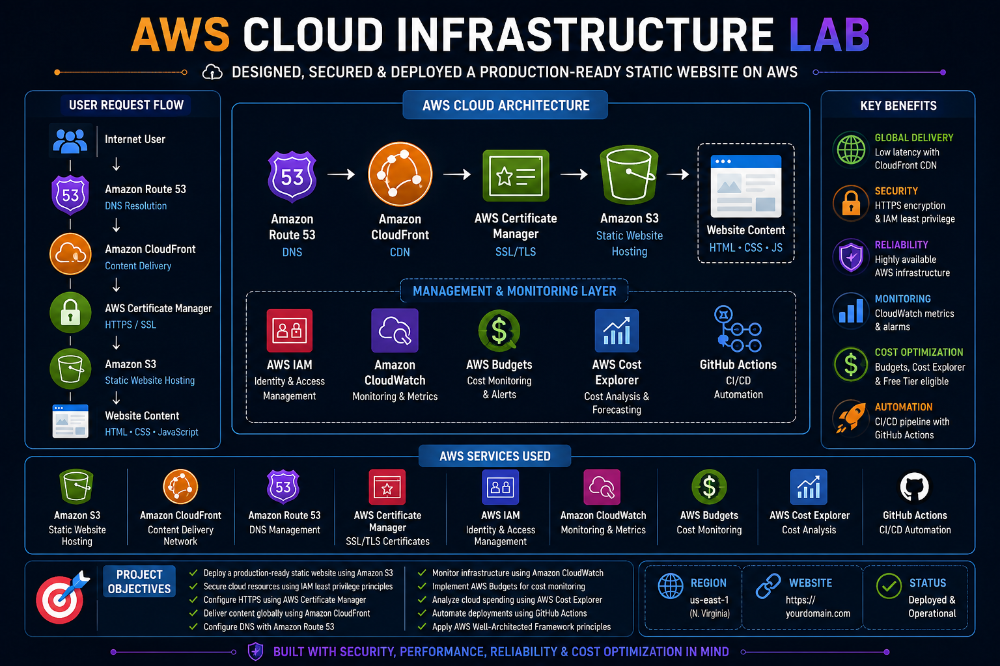

<div align="center">

# ☁️ AWS Enterprise Cloud Infrastructure Lab

### Designing, Securing, and Deploying a Production-Ready Static Website on AWS


</div>

---

## Overview

This project demonstrates the deployment of a secure, scalable, and production-ready AWS cloud infrastructure using core AWS services.

The environment was designed to showcase foundational cloud engineering skills by implementing secure identity management, static website hosting, global content delivery, DNS management, monitoring, cost optimization, and deployment automation.

The project follows AWS security best practices and aligns with the AWS Well-Architected Framework while providing hands-on experience with real-world cloud infrastructure.

### AWS Services Used

- Amazon S3
- Amazon CloudFront
- Amazon Route 53
- AWS Certificate Manager (ACM)
- AWS Identity and Access Management (IAM)
- Amazon CloudWatch
- AWS Budgets
- AWS Cost Explorer
- GitHub Actions (CI/CD)

---


The project includes:

* Amazon S3 Static Website Hosting
* AWS Identity and Access Management (IAM)
* AWS Certificate Manager (ACM)
* Amazon CloudFront
* Amazon Route 53
* Amazon CloudWatch
* AWS Budgets
* AWS Cost Explorer
* IAM Security Best Practices
* GitHub Version Control
* GitHub Actions (CI/CD)
* AWS Well-Architected Framework Review

The objective of this project was to gain practical experience deploying cloud infrastructure while implementing AWS security, reliability, operational excellence, performance efficiency, and cost optimization best practices.

---

## Environment

| Component               | Purpose                               |
| ----------------------- | ------------------------------------- |
| AWS Management Console  | Cloud administration                  |
| Amazon S3               | Static website hosting                |
| Amazon CloudFront       | Global content delivery network (CDN) |
| Amazon Route 53         | DNS management                        |
| AWS Certificate Manager | SSL/TLS certificate management        |
| AWS IAM                 | Identity and access management        |
| Amazon CloudWatch       | Monitoring and metrics                |
| AWS Budgets             | Cost monitoring                       |
| AWS Cost Explorer       | Billing analysis                      |
| GitHub                  | Source code management                |
| GitHub Actions          | Continuous deployment                 |

---

## Cloud Architecture

### User Request Flow

```text
Internet User
      │
      ▼
Amazon Route 53
      │
      ▼
Amazon CloudFront
      │
      ▼
AWS Certificate Manager (HTTPS)
      │
      ▼
Amazon S3 Static Website
      │
      ▼
HTML • CSS • JavaScript
```

### Management Services

The environment utilizes several AWS services to provide security, monitoring, and operational visibility.

* IAM manages authentication and authorization.
* CloudWatch collects metrics and operational data.
* AWS Budgets monitors monthly spending.
* Cost Explorer provides cost analysis and forecasting.
* GitHub Actions automates website deployments.

---

## Project Objectives

* Deploy a production-ready static website using Amazon S3.
* Secure cloud resources using IAM least privilege principles.
* Configure HTTPS using AWS Certificate Manager.
* Deliver content globally using Amazon CloudFront.
* Configure DNS with Amazon Route 53.
* Monitor infrastructure using Amazon CloudWatch.
* Implement AWS Budgets for cost monitoring.
* Analyze cloud spending using AWS Cost Explorer.
* Automate deployments using GitHub Actions.
* Apply AWS Well-Architected Framework principles.

---

# Phase 1: AWS Account Security

## Configure AWS Account

The AWS account was secured by implementing security best practices before deploying any infrastructure.

### Security Tasks

* Enabled Multi-Factor Authentication (MFA)
* Created administrative IAM user
* Restricted use of the root account
* Configured account password policy
* Verified account contact information

### IAM Administrator Account

| Setting     | Value               |
| ----------- | ------------------- |
| Username    | cloudadmin          |
| Access Type | Console Access      |
| MFA         | Enabled             |
| Permissions | AdministratorAccess |

### Outcome

Administrative activities are performed using an IAM user instead of the root account, reducing risk and following AWS security best practices.

**Screenshot**

```
screenshots/01-aws-console.png
```

---

# Phase 2: Identity and Access Management

## Configure IAM

AWS Identity and Access Management (IAM) was used to create secure identities and control access to AWS resources.

### Tasks Completed

* Created IAM users
* Configured IAM groups
* Assigned permissions
* Enabled MFA
* Reviewed IAM policies
* Applied least privilege principles

### IAM Groups

| Group          | Permissions         |
| -------------- | ------------------- |
| Administrators | AdministratorAccess |
| Developers     | PowerUserAccess     |
| ReadOnly       | ReadOnlyAccess      |

### Security Features

* Multi-Factor Authentication
* Password Policy
* Least Privilege
* Role-Based Access Control (RBAC)

### Outcome

Access to AWS resources is controlled through IAM users and groups rather than using the root account.

**Screenshot**

```
screenshots/02-iam-users.png
```

---

# Phase 3: Amazon S3 Static Website Hosting

## Create Amazon S3 Bucket

An Amazon S3 bucket was created to host a static portfolio website.

### Bucket Configuration

| Setting             | Value                           |
| ------------------- | ------------------------------- |
| Bucket Name         | aws-cloud-portfolio-platform    |
| Region              | us-east-1                       |
| Versioning          | Enabled                         |
| Encryption          | AES-256                         |
| Block Public Access | Disabled (Website Hosting Only) |

### Website Files

The following files were uploaded:

* index.html
* style.css
* script.js
* assets/
* images/

### Static Website Hosting

Static website hosting was enabled through the bucket properties.

### Bucket Policy

A bucket policy was configured to allow public read access for website content while limiting administrative access through IAM.

### Outcome

The website became publicly accessible through the Amazon S3 website endpoint.

**Screenshot**

```
screenshots/03-s3-bucket.png
```

---

# Phase 4: Amazon CloudFront

## Configure Content Delivery Network

Amazon CloudFront was deployed in front of the S3 bucket to improve website performance, reduce latency, and provide HTTPS support.

### Distribution Configuration

| Setting     | Value                  |
| ----------- | ---------------------- |
| Origin      | Amazon S3              |
| Protocol    | HTTPS                  |
| Compression | Enabled                |
| Caching     | Enabled                |
| Price Class | Use All Edge Locations |

### Benefits

* Global content delivery
* Lower latency
* HTTPS encryption
* Edge caching
* Improved availability
* DDoS resilience

### Outcome

Website traffic is delivered through AWS edge locations, improving performance for users worldwide.

**Screenshot**

```
screenshots/04-cloudfront.png
```

---

# Phase 5: Amazon CloudWatch Monitoring

## Monitor Cloud Infrastructure

Amazon CloudWatch was used to explore monitoring capabilities and gain operational visibility into the deployed AWS infrastructure.

### Monitoring Tasks

- Accessed Amazon CloudWatch
- Explored CloudWatch Metrics
- Reviewed AWS monitoring services
- Examined monitoring dashboards
- Learned CloudWatch monitoring workflow

### Services Monitored

| Service | Purpose |
|----------|----------|
| Amazon CloudWatch | Infrastructure monitoring |
| Amazon S3 | Storage metrics |
| Amazon CloudFront | Performance metrics |

### Outcome

Amazon CloudWatch provides centralized monitoring, metrics collection, dashboards, alarms, and operational visibility for AWS resources. This enables administrators to monitor cloud infrastructure health and performance from a single service.

### Screenshot


---
```
screenshots/05-acm-certificate.png
```

---

# Phase 6: Amazon Route 53

## Configure DNS

Amazon Route 53 was configured to manage DNS records and route traffic to the CloudFront distribution.

### Hosted Zone

| Record Type | Target                  |
| ----------- | ----------------------- |
| A (Alias)   | CloudFront Distribution |
| AAAA        | CloudFront Distribution |

### Tasks Completed

* Created Hosted Zone
* Configured Alias records
* Linked custom domain
* Verified DNS propagation

### Outcome

Users can access the website using a custom domain name secured with HTTPS.

**Screenshot**

```
screenshots/06-route53.png
```

---

# Phase 7: Amazon CloudWatch Monitoring

## Configure CloudWatch Monitoring

Amazon CloudWatch was configured to monitor the health and performance of the deployed cloud infrastructure.

### Monitoring Objectives

- Monitor website requests
- Observe CloudFront performance
- Track S3 metrics
- Monitor HTTP error rates
- Verify infrastructure availability

### CloudWatch Metrics

| Metric | Purpose |
|----------|----------|
| Requests | Total website requests |
| Bytes Downloaded | Network usage |
| Cache Hit Rate | CloudFront performance |
| 4XX Error Rate | Client-side errors |
| 5XX Error Rate | Server-side errors |

### Tasks Completed

- Enabled CloudWatch Metrics
- Reviewed CloudFront metrics
- Verified request statistics
- Monitored bandwidth utilization
- Reviewed error metrics

### Outcome

CloudWatch provides operational visibility into infrastructure performance and supports proactive monitoring.

**Screenshot**

```
screenshots/07-cloudwatch-dashboard.png
```

---

# Phase 8: AWS Budgets

## Configure Cost Monitoring

AWS Budgets was configured to monitor monthly cloud spending and generate alerts when spending thresholds are exceeded.

### Budget Configuration

| Setting | Value |
|----------|----------|
| Budget Type | Monthly Cost Budget |
| Budget Amount | $10 USD |
| Alert Threshold | 80% |
| Final Threshold | 100% |
| Notification | Email |

### Tasks Completed

- Created monthly budget
- Configured alert thresholds
- Verified email notifications
- Reviewed estimated monthly cost

### Outcome

Budget alerts provide early warning of unexpected spending and help maintain cost control.

**Screenshot**

```
screenshots/08-aws-budgets.png
```

---

# Phase 9: AWS Cost Explorer

## Analyze Cloud Spending

AWS Cost Explorer was used to analyze service usage and estimate monthly operating costs.

### Services Reviewed

- Amazon S3
- Amazon CloudFront
- Amazon Route 53
- AWS Certificate Manager
- Amazon CloudWatch

### Cost Optimization

The project was designed to minimize operating costs by utilizing AWS Free Tier eligible services whenever possible.

### Estimated Monthly Cost

| Service | Estimated Cost |
|----------|----------------|
| Amazon S3 | Minimal |
| CloudFront | Low |
| Route 53 | Domain + Hosted Zone |
| ACM | No Additional Cost |
| CloudWatch | Free Tier Usage |
| AWS Budgets | Free |

### Outcome

The infrastructure provides a secure and scalable solution while maintaining a low monthly operating cost.

**Screenshot**

```
screenshots/09-cost-explorer.png
```

---

# Phase 10: GitHub Actions CI/CD

## Configure Continuous Deployment

GitHub Actions was integrated with AWS to automate deployment of the static website.

### Deployment Workflow

1. Developer pushes code to GitHub.
2. GitHub Actions workflow executes.
3. Website files synchronize with Amazon S3.
4. CloudFront cache invalidation is triggered.
5. Updated website becomes available globally.

### Benefits

- Automated deployments
- Faster updates
- Version control
- Reduced manual administration
- Consistent deployment process

### Outcome

Website deployments can be completed automatically after each code commit.

**Screenshot**

```
screenshots/10-github-actions.png
```

---

# Phase 11: Infrastructure Validation

## Validate Cloud Infrastructure

The deployed environment was tested to ensure all AWS services were functioning correctly.

### Website Validation

- Website loads successfully
- HTTPS connection verified
- SSL certificate validated
- CloudFront distribution operational

### DNS Validation

```bash
nslookup yourdomain.com
```

### HTTPS Validation

```bash
curl -I https://yourdomain.com
```

### Connectivity Validation

```bash
ping yourdomain.com
```

### Results

- DNS resolves successfully
- HTTPS encryption verified
- CloudFront caching operational
- Website accessible globally

**Screenshot**

```
screenshots/11-live-website.png
```

---

# Phase 12: AWS Well-Architected Framework Review

## Evaluate Infrastructure

The deployed solution was evaluated using the AWS Well-Architected Framework.

### Operational Excellence

- Infrastructure documented
- GitHub version control implemented
- CI/CD deployment pipeline configured

### Security

- IAM Least Privilege
- MFA Enabled
- HTTPS Encryption
- IAM Groups
- IAM Policies

### Reliability

- Highly durable Amazon S3 storage
- CloudFront global edge network
- Managed AWS services

### Performance Efficiency

- Global CDN
- Edge caching
- Optimized content delivery

### Cost Optimization

- AWS Budgets
- Cost Explorer
- Free Tier eligible services
- Minimal operational costs

### Sustainability

- Fully managed cloud services
- Efficient resource utilization
- Minimal infrastructure overhead

**Screenshot**

```
screenshots/12-well-architected-review.png
```

---

# Results

The environment successfully demonstrated:

✅ Secure AWS account configuration

✅ Identity and Access Management (IAM)

✅ Amazon S3 Static Website Hosting

✅ CloudFront Content Delivery

✅ HTTPS with AWS Certificate Manager

✅ Route 53 DNS Management

✅ CloudWatch Monitoring

✅ AWS Budgets Cost Management

✅ AWS Cost Explorer Analysis

✅ GitHub Actions Continuous Deployment

✅ AWS Well-Architected Framework Implementation

---

# Skills Demonstrated

## Cloud Infrastructure

- AWS Management Console
- Amazon S3
- Amazon CloudFront
- Amazon Route 53
- AWS Certificate Manager
- Amazon CloudWatch

## Identity & Security

- IAM Users
- IAM Groups
- IAM Policies
- Least Privilege
- Multi-Factor Authentication (MFA)
- HTTPS
- SSL/TLS

## Networking

- DNS Configuration
- Content Delivery Networks (CDN)
- HTTPS
- Public Website Hosting
- Domain Management

## Cost Management

- AWS Budgets
- AWS Cost Explorer
- Free Tier Optimization
- Cost Monitoring

## DevOps

- Git
- GitHub
- GitHub Actions
- Continuous Deployment (CI/CD)

---

# Lessons Learned

Throughout this project, several AWS concepts were reinforced through hands-on implementation.

### Technical Knowledge

- Identity and access management using IAM
- Secure static website hosting with Amazon S3
- Global content delivery with CloudFront
- Domain management with Route 53
- SSL certificate deployment using ACM
- Infrastructure monitoring with CloudWatch
- Cost optimization using AWS Budgets
- Automated deployments using GitHub Actions

### Best Practices

- Follow the Principle of Least Privilege
- Avoid using the AWS root account
- Enable Multi-Factor Authentication
- Monitor cloud resources continuously
- Automate repetitive deployment tasks
- Review cloud costs regularly

---

# Future Improvements

Potential enhancements include:

- Deploy a dynamic web application using Amazon EC2
- Integrate Amazon RDS for database services
- Implement AWS Lambda serverless functions
- Deploy infrastructure using AWS CloudFormation
- Migrate infrastructure to Terraform
- Configure AWS WAF for web application protection
- Implement Amazon CloudTrail logging
- Configure Amazon SNS notifications
- Deploy applications using Amazon ECS
- Integrate AWS CodePipeline

---

# Conclusion

This project demonstrates the deployment of a secure, scalable, and cost-effective cloud infrastructure using core AWS services. By implementing identity management, content delivery, monitoring, automation, and cost optimization, the environment reflects many of the foundational concepts expected of an AWS Cloud Engineer.

The project reinforced practical cloud administration skills while following AWS security best practices and the AWS Well-Architected Framework. It also serves as a strong portfolio project demonstrating hands-on experience with cloud infrastructure deployment, monitoring, automation, and operational management.
screenshots/06-route53.png
```
